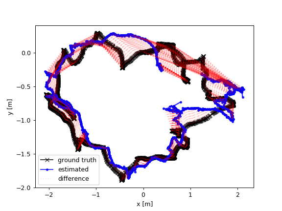

# iscv-tmp

## system require

1. axel
2. python
3. make

## some command

1. download dataset

    ```shell
    make download
    ```

2. configuration of python environment 

    ```shell
    make env
    ```

3. combination between depth and rgb

    ```shell
    make associate
    ```

4. build project

    ```shell
    make build
    ```

5. evaluate_rpe

    ```
    make evaluation_rpe
    ```

6. evaluate_ate

    ```shell
    make evaluate_ate
    ```

7. evaluate

    ```shell
    make evaluate
    ```

## calibration

|Camera|fx|fy|cx|cy|d0|d1|d2|d3|d4|
| ------ | ---- | ---- | ---- | ---- | ---- | ---- | ---- | ---- | ---- |
| (ROS default)  	| 	525.0  	| 	525.0  	| 	319.5  	| 	239.5  	| 	0.0  	| 	0.0  	| 	0.0  	| 	0.0  	| 	0.0 |
| Freiburg 1 RGB  	| 	517.3  	| 	516.5  	| 	318.6  	| 	255.3  	| 	0.2624 | -0.9531 | -0.0054 | 0.0026  | 	1.1633 |
| Freiburg 2 RGB  	| 	520.9  	| 	521.0  	| 	325.1  	| 	249.7  	| 	0.2312 | -0.7849 |-0.0033 | -0.0001  	| 	0.9172 |
| Freiburg 3 RGB  	| 	535.4  	| 	539.2  	| 	320.1  	| 	247.6  	| 	0  	| 	0  	| 	0  	| 	0  	| 	0 |


## todo

1. rewrite matlab code to python

    | No   | task modules              | deadline   | status        |
    | ---- | ------------------------- | ---------- | ------------- |
    | 1.1  | `se3Log`                  | 14.06.2020 | *implemented* |
    | 1.2  | `se3Exp`                  | 14.06.2020 | *implemented* |
    | 1.3  | `imreadbw`                | 14.06.2020 | *implemented* |
    | 1.4  | `calcResiduals`           | 14.06.2020 | *implemented* |
    | 1.5  | `deriveResidualsAnalytic` | 14.06.2020 | -             |
    | 1.6  | `deriveResidualsNumeric`  | 14.06.2020 | *implemented* |
    | 1.7  | `downscale`               | 14.06.2020 | *implemented* |
    | 1.8  | `doAlignment`             | 14.06.2020 | *implemented* |

2. Implement keyframe-based camera tracking through direct image alignment.

    | No   | task modules                                                 | deadline | status        |
    | ---- | ------------------------------------------------------------ | -------- | ------------- |
    | 2.1  | process the RGB-D images only up to a downsampled size in the image pyramid | -        | *implemented* |
    | 2.2  | Choose thresholds on the rotational and translational distance to create new keyframes, when the image overlap gets too small for camera tracking |          | *implemented* |
    | 2.3  | Implement the relative entropy measure to decide when to create new keyframes |          |               |
    | 2.4  | Implement pose-graph optimization for the keyframe poses using the Gauss-Newton algorithm and left-multiplied increments on the poses. |          |               |
    
    The sample of `2.2` is bellow:
    
    


3. optimal key-frame

    | No   | task modules | deadline | status |
    | ---- | ------------ | -------- | ------ |
    | 3.1  |              |          |        |
    | 3.2  |              |          |        |
    | 3.3  |              |          |        |
    | 3.4  |              |          |        |
    
4. second party
   
    | No   | task modules | deadline | status |
    | ---- | ------------ | -------- | ------ |
    | 4.1  |              |          |        |
    | 4.2  |              |          |        |
    | 4.3  |              |          |        |
    | 4.4  |              |          |        |


5. pending
